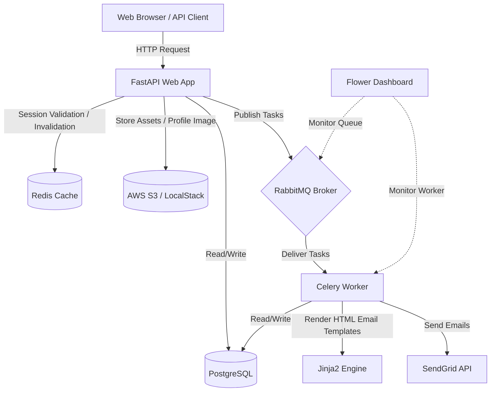

# Production-Grade FastAPI Template Project

This repository contains a production-grade FastAPI template project, structured for high-performance async APIs, database migrations, backgrounds tasks, local cloud storage emulation, robust security, and advanced logging.

## Tech Stack

*   **Core API:** [FastAPI](https://fastapi.tiangolo.com/) (using the latest features: lifespans, type annotations)
*   **Database & ORM:** [SQLModel](https://sqlmodel.tiangolo.com/) (combining SQLAlchemy + Pydantic)
*   **Database Migrations:** [Alembic](https://alembic.sqlalchemy.org/)
*   **Caches & Session Store:** [Redis](https://redis.io/)
*   **Message Broker:** [RabbitMQ](https://www.rabbitmq.com/)
*   **Background Worker:** [Celery](https://docs.celeryq.dev/)
*   **Email Deliverability:** [SendGrid](https://sendgrid.com/) (with clean, responsive HTML templates)
*   **Object Storage:** AWS S3 (mocked locally using [LocalStack](https://localstack.cloud/))
*   **Containerization:** [Docker](https://www.docker.com/) & Docker Compose
*   **Testing:** [Pytest](https://docs.pytest.org/) & [HTTPX AsyncClient](https://www.python-httpx.org/) (runs offline with in-memory SQLite + mocks)
*   **Dependency Management:** [uv](https://github.com/astral-sh/uv) (fastest Python packaging tool)

---

## Architecture Diagram



For detailed documents on specific components, refer to the [docs](file:///Users/danielale/Documents/software-projects/fastapi-template/docs) folder:
*   [Architecture Design](file:///Users/danielale/Documents/software-projects/fastapi-template/docs/architecture.md)
*   [API Endpoint Reference](file:///Users/danielale/Documents/software-projects/fastapi-template/docs/api-reference.md)
*   [Security Protocols](file:///Users/danielale/Documents/software-projects/fastapi-template/docs/security.md)
*   [Database Migrations Guide](file:///Users/danielale/Documents/software-projects/fastapi-template/docs/migrations.md)
*   [Docker Containerization Guide](file:///Users/danielale/Documents/software-projects/fastapi-template/docs/docker.md)

---

## Advanced Features & Implementations

### 1. Swagger UI Authentication Persistence
Swagger UI by default clears your authorization header when reloading. We enabled:
```python
app = FastAPI(swagger_ui_parameters={"persistAuthorization": True})
```
This instructs Swagger to store your Bearer tokens in the browser's `localStorage`, maintaining authentication states across page reloads.

### 2. Request/Response Masking Logging Middleware
A custom Starlette middleware captures every incoming request and outgoing response. Before emitting console logs, a custom logging formatter recursively scans payloads for keys defined in `settings.SENSITIVE_KEYS` (e.g. `password`, `token`, `secret`, `credit_card`) and masks them:
*   Outputs `***FILTERED***` for sensitive parameters.
*   Emits colored logs in the console for enhanced legibility.
*   Uses a safe `AsyncIteratorWrapper` to read and log request/response bodies without interrupting ASGI transport streams.

### 3. Celery Signal Execution Metrics
We hook into Celery signals (`task_prerun`, `task_postrun`, and `task_failure`) to record:
*   Task execution duration.
*   Task input parameters (args and kwargs) and return values.
*   Automatically masks sensitive information inside Celery logs using the same masking formatter.

### 4. IP Whitelisting & Scoped API Keys
*   **IP Whitelisting:** Selective route-level protection using an `IPWhitelistChecker` dependency. Reads client IPs (respecting reverse proxies via `X-Forwarded-For`) and evaluates them against `settings.ALLOWED_IPS`.
*   **Scoped API Keys:** Allows third-party client integrations. Issues unique API keys with specific scope bounds (e.g., `assets:audit`). Key hashes are checked in PostgreSQL (using SHA-256) and verified on every call.

---

## Local Development & Setup

### Environment Variables
Copy the example environment file:
```bash
cp .env.example .env
```

### Running with Docker Compose
You can run the entire infrastructure stack (Postgres, Redis, RabbitMQ, LocalStack, FastAPI, Celery Worker, Flower, and the DB Migrator) with a single command:
```bash
docker compose up --build
```
Once initialized:
*   **FastAPI API:** [http://localhost:8000](http://localhost:8000)
*   **Swagger Documentation:** [http://localhost:8000/docs](http://localhost:8000/docs)
*   **Flower Celery Dashboard:** [http://localhost:5555](http://localhost:5555)
*   **RabbitMQ Dashboard:** [http://localhost:15672](http://localhost:15672) (User/Pass: guest/guest)
*   **LocalStack Endpoint:** [http://localhost:4566](http://localhost:4566)

On first startup, the app automatically runs migrations and seeds a default administrator:
*   **Email:** `admin@example.com`
*   **Password:** `AdminPassword123!`

---

## Running Automated Tests

E2E integration tests are written in Pytest. They use an in-memory `aiosqlite` connection and mock out Redis, S3, and Celery, running fully self-contained in less than 3 seconds without needing Docker to be active.

To execute tests:
```bash
uv run pytest
```
